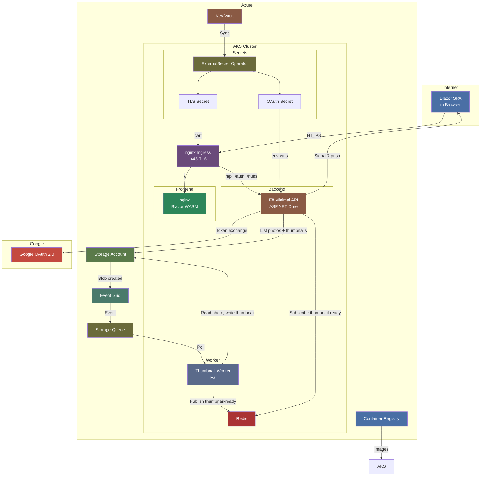
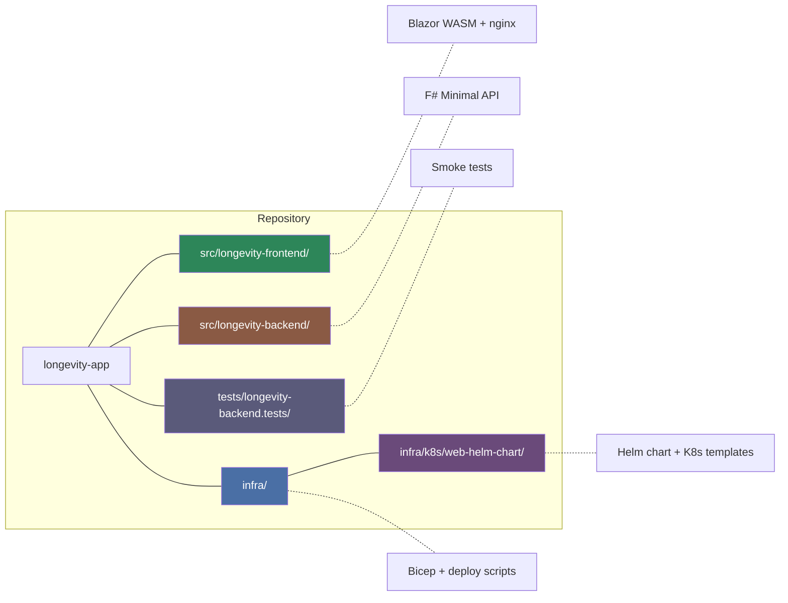

# Longevity App

Health & longevity tracking application.

## Architecture Overview



## Project Structure



## End-to-End Request Flow

```mermaid
sequenceDiagram
    box rgb(170,255,200) SPA
    participant SPA as Blazor SPA (Browser)
    end
    box rgb(170,210,255) Ingress
    participant ING as nginx Ingress (:443)
    end
    participant Files as Static Files (nginx)
    box rgb(255,180,180) Backend
    participant BE as Backend (F# API)
    end
    participant Google as Google OAuth

    Note over SPA: Single-page application<br/>running client-side

    rect rgb(40, 60, 40)
    Note over SPA,Files: Page Load

    SPA->>ING: GET / (HTTPS)
    ING->>Files: Route to frontend-svc
    Files-->>SPA: index.html + Blazor WASM
    end

    rect rgb(40, 40, 60)
    Note over SPA,BE: API Call

    SPA->>ING: GET /api/weatherforecast
    ING->>BE: Route to backend-svc
    BE-->>SPA: JSON response
    end

    rect rgb(60, 40, 40)
    Note over SPA,Google: Authentication

    SPA->>ING: GET /auth/login
    ING->>BE: Route to backend-svc
    BE-->>SPA: 302 → Google consent
    SPA->>Google: Approve access
    Google-->>SPA: 302 → /auth/callback?code=…
    SPA->>ING: GET /auth/callback?code=…
    ING->>BE: Route to backend-svc
    BE->>Google: Exchange code → access token
    BE->>Google: Fetch email with Bearer token
    BE-->>SPA: Authorized / Denied
    end
```



## Photo Pipeline

```mermaid
sequenceDiagram
    participant Phone as Android App
    participant Blob as Azure Blob<br/>(photos)
    participant EG as Event Grid
    participant Q as Storage Queue
    participant TW as Thumbnail Worker
    participant Thumb as Azure Blob<br/>(thumbnails)
    participant Redis as Redis
    participant BE as Backend
    participant SPA as Blazor SPA

    rect rgb(40, 60, 40)
    Note over Phone,Blob: Upload

    Phone->>Blob: Sync photo from DCIM
    end

    rect rgb(40, 40, 60)
    Note over Blob,TW: Thumbnail Generation

    Blob->>EG: BlobCreated event
    EG->>Q: Enqueue event
    TW->>Q: Poll queue
    Q-->>TW: Event message
    TW->>Blob: Download photo
    Blob-->>TW: Photo bytes
    TW->>Thumb: Upload resized thumbnail
    end

    rect rgb(60, 40, 40)
    Note over TW,SPA: Real-time Notification & Fetch

    TW->>Redis: PUBLISH thumbnail-ready
    Redis->>BE: Notify subscriber
    BE->>SPA: SignalR "PhotosChanged"
    end

    rect rgb(50, 50, 30)
    Note over SPA,Thumb: Delegated SAS Fetch

    SPA->>BE: GET /api/photos (authenticated)
    BE->>BE: GetUserDelegationKeyAsync (Entra ID)
    BE->>BE: Build SAS URL per blob<br/>(BlobSasPermissions.Read, 1h TTL)
    BE-->>SPA: PhotoInfo[] with thumbnailUrl = SAS URL
    SPA->>Thumb: GET thumbnailUrl (direct, no backend proxy)
    Thumb-->>SPA: JPEG bytes
    end
```



## Tech Stack

| Layer | Technology |
|-------|-----------|
| Frontend | Blazor WebAssembly, nginx |
| Backend | F# / ASP.NET Core Minimal API (.NET 10) |
| Auth | Google OAuth 2.0 |
| Messaging | Redis Pub/Sub (in-cluster) |
| Container | Docker (linux/amd64) |
| Registry | Azure Container Registry |
| Orchestration | AKS (Kubernetes) + Helm |
| Ingress | nginx Ingress Controller + TLS |
| Secrets | Azure Key Vault + ExternalSecret Operator |
| Storage | Azure Storage Account |
| Events | Azure Event Grid + Storage Queue |
| IaC | Bicep |
| Scripts | PowerShell 7 |

## Quick Start

```powershell
# Deploy everything
pwsh infra/scripts/deploy-all.ps1

# Deploy only backend
pwsh infra/scripts/app/deploy-backend.ps1

# Deploy only frontend
pwsh infra/scripts/app/deploy-frontend.ps1

# Run backend locally
cd src/longevity-backend && dotnet run

# Run frontend locally
cd src/longevity-frontend && dotnet run
```

See individual READMEs for details:
- [Backend](src/longevity-backend/README.md) — API routes, OAuth flow
- [Frontend](src/longevity-frontend/README.md) — SPA architecture, request flow
- [Infrastructure](infra/README.md) — Azure resources, deployment pipeline, ingress routing

## Related READMEs

- [Backend](src/longevity-backend/README.md)
- [Frontend](src/longevity-frontend/README.md)
- [Infrastructure](infra/README.md)
