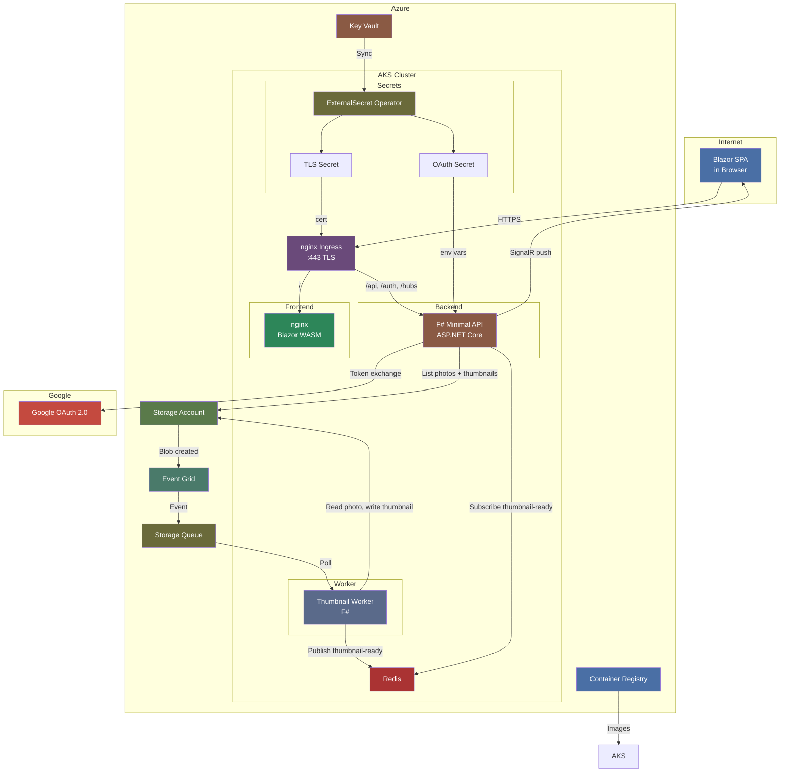
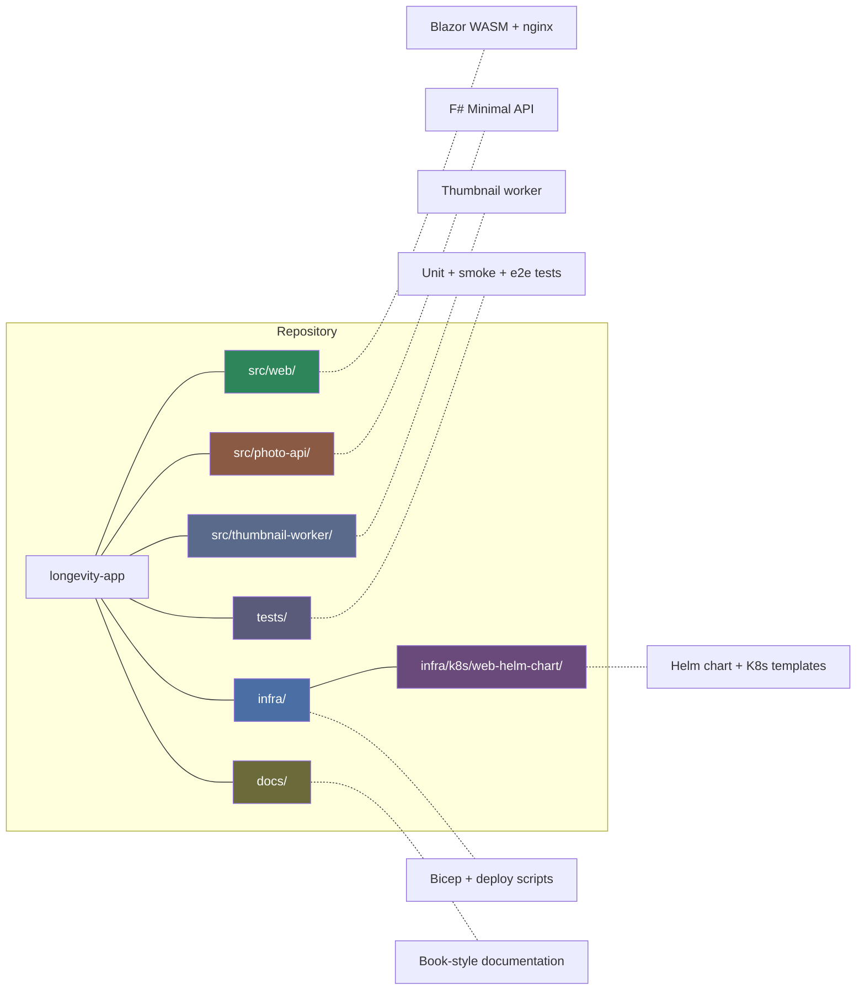
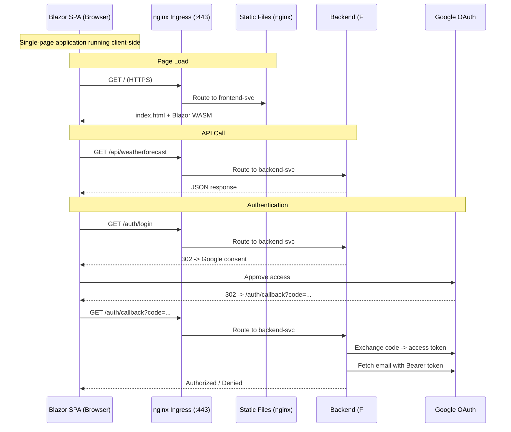

# 01 — Overview

[Home](../README.md) · [Diagrams](diagrams.md) · [Services](02-services.md)

## What it does

Longevity is a personal photo-browsing application. Photos are synced from an
Android device directly to Azure Blob Storage. The app automatically generates
thumbnails, lets users organise photos into named groups, and pushes real-time
updates to the browser via SignalR.

---

## Architecture



---

## Tech stack

| Layer | Technology |
|-------|------------|
| Frontend | Blazor WebAssembly (.NET 10), nginx |
| Backend API | F# / ASP.NET Core Minimal API (.NET 10) |
| Background worker | F# / .NET Generic Host |
| Database | PostgreSQL (in-cluster) — photo groups |
| Messaging | Redis Pub/Sub (in-cluster) — thumbnail notifications |
| Real-time | SignalR (`/hubs/photos`) |
| Auth | Google OAuth 2.0 + encrypted HttpOnly cookie |
| Data protection | ASP.NET Data Protection — keys persisted to Redis |
| Container images | Docker (`linux/amd64`) |
| Registry | Azure Container Registry (`longevityacr`) |
| Orchestration | AKS (Kubernetes) + Helm |
| Ingress | nginx Ingress Controller + TLS (Let's Encrypt) |
| Secrets | Azure Key Vault + ExternalSecret Operator |
| Storage | Azure Blob Storage (`longevityphotos`) |
| Events | Azure Event Grid + Storage Queue (`thumbnail-events`) |
| IaC | Bicep |
| Scripting | PowerShell 7 |

---

## Repository layout



```
longevity-app/
├── src/
│   ├── photo-api/          ← F# backend API      → docs/02-services.md
│   ├── thumbnail-worker/   ← F# thumbnail worker  → docs/02-services.md
│   └── web/                ← Blazor WASM frontend → docs/02-services.md
├── infra/
│   ├── azure/              ← Bicep modules        → docs/06-infrastructure.md
│   ├── k8s/                ← Helm + K8s manifests → docs/06-infrastructure.md
│   └── scripts/            ← PowerShell scripts   → docs/09-deployment.md
└── tests/
    ├── photo-api.tests/    ← Unit + smoke tests
    └── web.e2e/            ← Playwright E2E tests
```

---

## End-to-end request flow



---

Next: [02 — Services](02-services.md)
