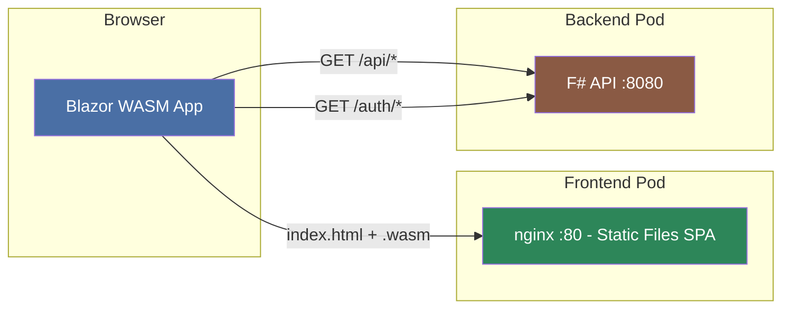
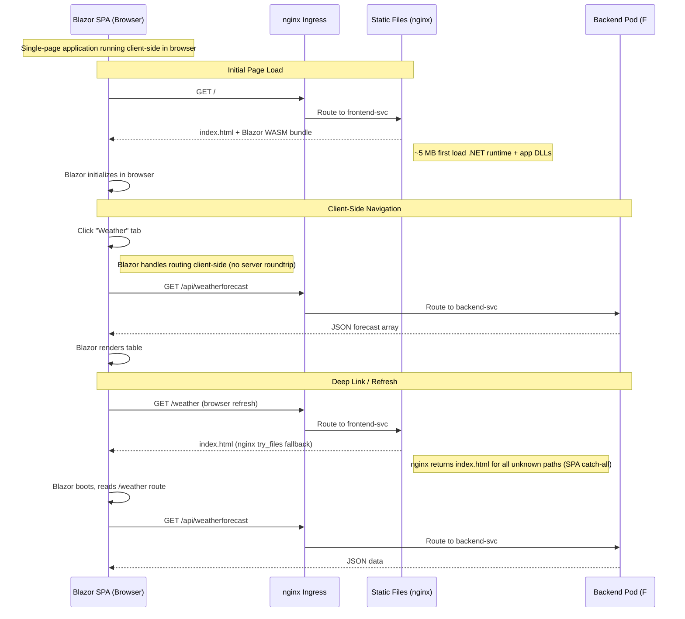
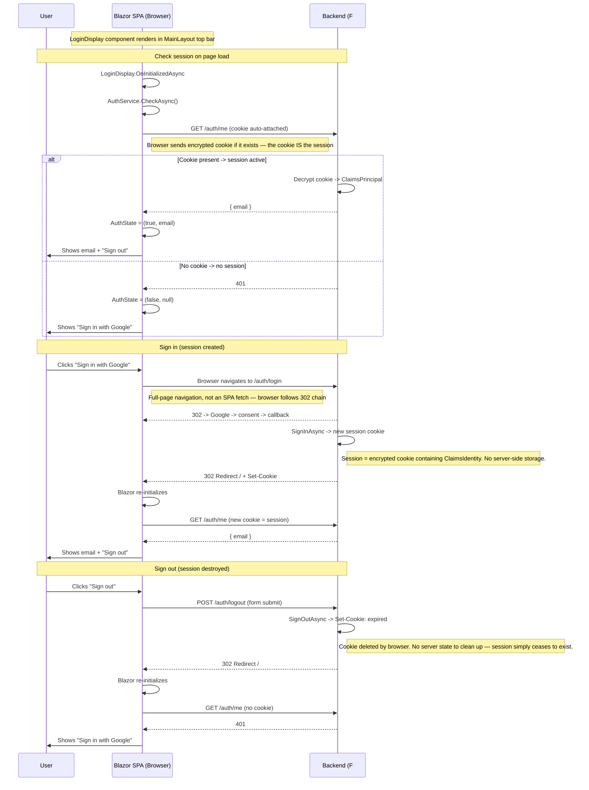

# 02 — Services

[Home](../README.md) · [Diagrams](diagrams.md) · [Overview](01-overview.md) · [API Reference](03-api-reference.md)

---

## Frontend — Blazor WebAssembly

**Source:** [src/web](../src/web)

A Blazor WebAssembly single-page application served as static files by nginx.
The `.wasm` bundle runs entirely in the browser — no server-side rendering.

### Pages & components

| Path | File | Purpose |
|------|------|---------|
| `/` | [Pages/Home.razor](../src/web/Pages/Home.razor) | Photo gallery with group tree |
| `*` (not found) | [Pages/NotFound.razor](../src/web/Pages/NotFound.razor) | 404 fallback |

| Component | File | Purpose |
|-----------|------|---------|
| `LoginDisplay` | [Components/LoginDisplay.razor](../src/web/Components/LoginDisplay.razor) | Auth status bar (email / sign-in link) |
| `PhotoCard` | [Components/PhotoCard.razor](../src/web/Components/PhotoCard.razor) | Single photo tile with thumbnail |
| `GroupTreeNode` | [Components/GroupTreeNode.razor](../src/web/Components/GroupTreeNode.razor) | Recursive node in the group tree sidebar |
| `RootGroupSection` | [Components/RootGroupSection.razor](../src/web/Components/RootGroupSection.razor) | Top-level group section wrapper |
| `CalendarPopup` | [Components/CalendarPopup.razor](../src/web/Components/CalendarPopup.razor) | Date-picker for filtering photos by day |

### nginx configuration

nginx serves the static Blazor bundle and applies a `try_files` catch-all so
all unknown paths return `index.html` (required for SPA client-side routing).
See [src/web/docker](../src/web/docker) for the nginx config.

### Service topology

### Request flow

### Authentication in the SPA

---

## Backend — photo-api (F# ASP.NET Core)

**Source:** [src/photo-api](../src/photo-api)  
**Port (in-cluster):** 8080  
**Framework:** ASP.NET Core Minimal API, .NET 10

### Key source files

| File | Responsibility |
|------|----------------|
| [Program.fs](../src/photo-api/Program.fs) | DI wiring, middleware pipeline, route registration |
| [Routes.fs](../src/photo-api/Routes.fs) | Pure handler functions for every endpoint |
| [Auth.fs](../src/photo-api/Auth.fs) | OAuth result types and email allow-list check |
| [AuthLogin.fs](../src/photo-api/AuthLogin.fs) | Build Google OAuth redirect URL |
| [AuthCallback.fs](../src/photo-api/AuthCallback.fs) | Exchange auth code for email via Google token endpoint |
| [Storage.fs](../src/photo-api/Storage.fs) | List blobs, generate User Delegation SAS URLs, delete blobs |
| [PhotoGroups.fs](../src/photo-api/PhotoGroups.fs) | PostgreSQL CRUD for photo groups (pure planning + impure IO) |
| [GroupNames.fs](../src/photo-api/GroupNames.fs) | Resolve all photo names belonging to a named group |
| [PhotoHub.fs](../src/photo-api/PhotoHub.fs) | SignalR hub — broadcasts `PhotosChanged` events |
| [ThumbnailSubscriber.fs](../src/photo-api/ThumbnailSubscriber.fs) | Redis subscriber: listens on `thumbnail-ready`, notifies hub |
| [PhotoCountCache.fs](../src/photo-api/PhotoCountCache.fs) | In-memory cache of photo counts, refreshed in background |
| [DbMigrations.fs](../src/photo-api/DbMigrations.fs) | Runs PostgreSQL schema migrations on startup |
| [Config.fs](../src/photo-api/Config.fs) | Typed config loading for OAuth, Storage, PostgreSQL |

### Services registered

- **SignalR** — hub at `/hubs/photos`
- **Redis** (`StackExchange.Redis`) — for pub/sub and Data Protection key storage
- **ASP.NET Data Protection** — keys persisted to Redis key `DataProtection-Keys`
- **`ThumbnailSubscriberService`** — hosted service subscribing to Redis `thumbnail-ready`
- **`PhotoCountCache` + `RefreshService`** — background cache for photo counts
- **HttpClient factory** — for Google OAuth HTTP calls

### Startup sequence

1. Load config (OAuth, Storage, Postgres, Redis)
2. Connect to Redis (`ConnectionMultiplexer`)
3. Register Data Protection with Redis backing
4. Build and start the app
5. Run DB migrations (`DbMigrations.run`)
6. Register routes

---

## Thumbnail Worker — F#

**Source:** [src/thumbnail-worker](../src/thumbnail-worker)  
**Framework:** .NET Generic Host (background service)

### What it does

1. On startup, runs a **catch-up scan**: generates thumbnails for any photos
   that already exist in Blob Storage but have no corresponding thumbnail.
2. Enters a **poll loop**: receives up to 10 messages at a time from the
   Azure Storage Queue `thumbnail-events`. For each message:
   - Parses the blob name from the Event Grid JSON payload.
   - Downloads the original photo from the `photos` container.
   - Resizes it to 400 px width using **ImageSharp**.
   - Uploads the JPEG to the `thumbnails` container.
   - Deletes the queue message (acknowledgement).
   - Publishes `thumbnail-ready` to Redis so the backend can notify connected browsers.
3. If the queue is empty, backs off for 5 seconds before polling again.

### Key source files

| File | Responsibility |
|------|----------------|
| [Program.fs](../src/thumbnail-worker/Program.fs) | Host setup, config loading, DI |
| [ThumbnailProcessor.fs](../src/thumbnail-worker/ThumbnailProcessor.fs) | Pure image resize logic, blob I/O, queue parsing |

### Authentication

Uses **AKS Workload Identity** — no secrets in the container image or
environment. See [07 — Workload Identity](07-workload-identity.md) for the
full token-exchange flow.

---

Next: [03 — API Reference](03-api-reference.md)
