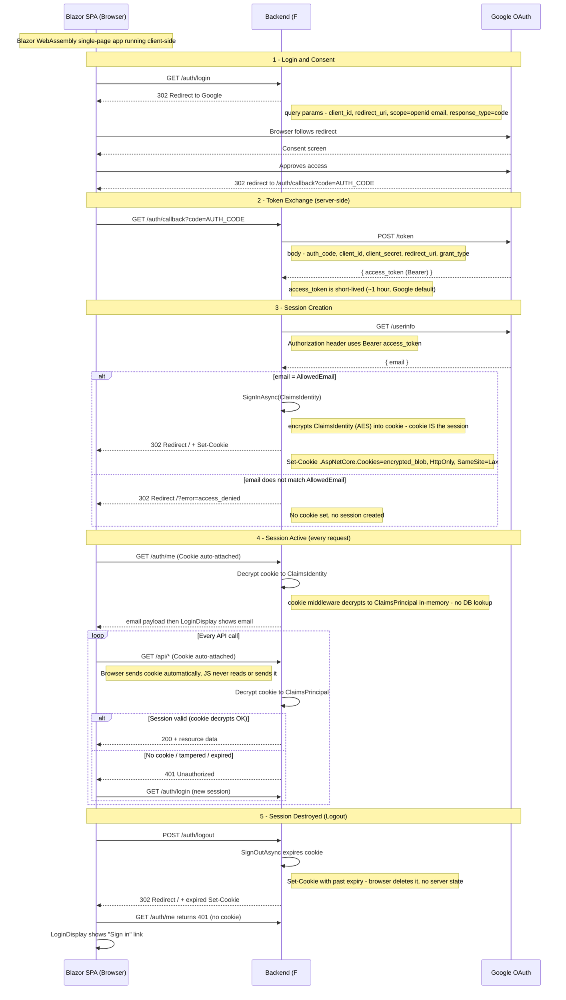
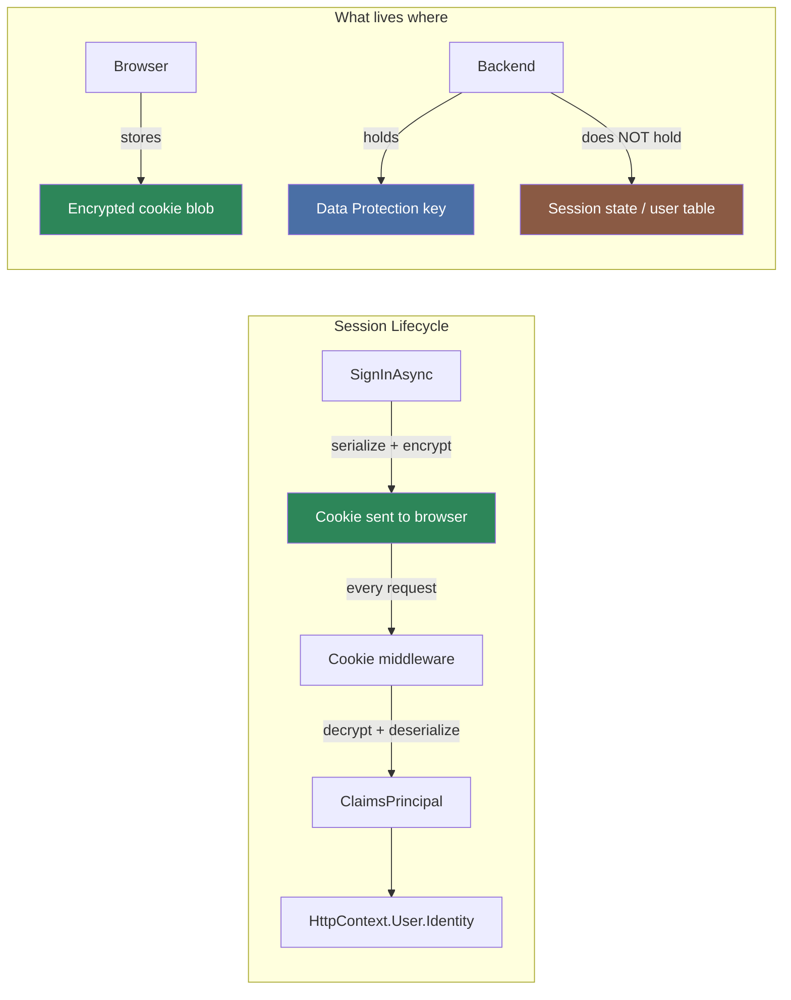
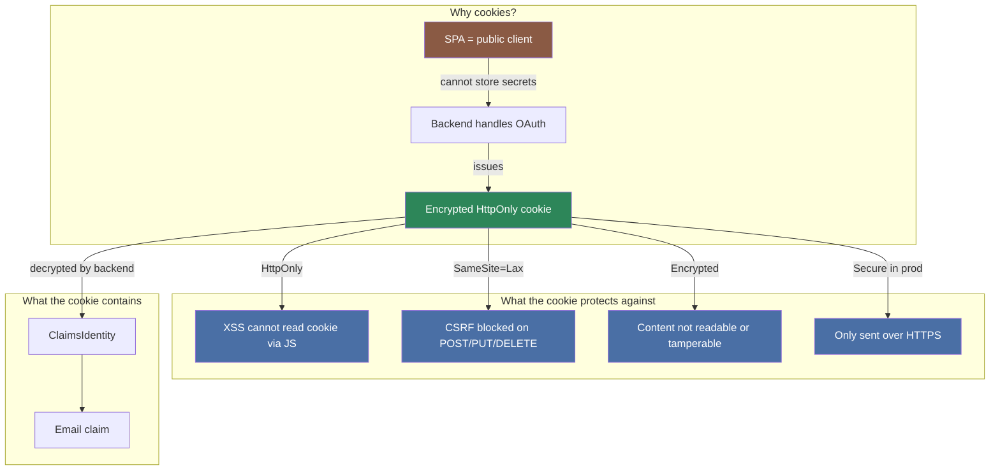

# 04 — Authentication

[Home](../README.md) · [Diagrams](diagrams.md) · [API Reference](03-api-reference.md) · [Photo Pipeline](05-photo-pipeline.md)

**Source files:** [Auth.fs](../src/photo-api/Auth.fs) ·
[AuthLogin.fs](../src/photo-api/AuthLogin.fs) ·
[AuthCallback.fs](../src/photo-api/AuthCallback.fs) ·
[Routes.fs](../src/photo-api/Routes.fs)

---

## Google OAuth 2.0 flow



---

## Cookie-as-session model

There is **no server-side session store**. The cookie itself is the session.



| Question | Answer |
|----------|--------|
| Where is the session stored? | Inside the cookie — the browser holds the encrypted blob |
| Is there a session ID? | No — the cookie payload contains the full `ClaimsIdentity` |
| What happens on backend restart? | Sessions remain valid as long as the Data Protection key in Redis survives |
| How does it expire? | ASP.NET sets a cookie expiry date — no server-side cleanup needed |
| How does logout work? | `SignOutAsync` issues `Set-Cookie` with a past date — browser deletes it |
| Is it stateless? | Yes — any backend replica can decrypt the cookie; no sticky sessions needed |

### Data Protection key storage

Keys are persisted to Redis with the key `DataProtection-Keys`:

```fsharp
builder.Services
    .AddDataProtection()
    .SetApplicationName("longevity-app")
    .PersistKeysToStackExchangeRedis(redis, "DataProtection-Keys")
```

This means all backend replicas share the same keys and can decrypt each
other's cookies without sticky routing.

---

## Cookie security properties



| Property | Value | Why |
|----------|-------|-----|
| `HttpOnly` | `true` | Invisible to JavaScript — XSS cannot steal it |
| `SameSite` | `Lax` | Browser sends cookie only to same-origin — blocks CSRF on mutations |
| Encrypted | ASP.NET Data Protection (AES + HMAC) | Cannot be forged or read |
| `Secure` | `true` in production | Only sent over HTTPS |
| No tokens in browser | — | Access token and client secret stay server-side |

---

## Credential lifecycle summary

| Phase | Credential in use |
|-------|-------------------|
| `GET /auth/login` → redirect | — |
| Google consent + callback | Authorization code (one-time, ~10 min) |
| `POST googleapis.com/token` | Code → **access token** (~1 hour) |
| `GET googleapis.com/userinfo` | **Bearer access_token** |
| `SignInAsync` | Encrypted **cookie** issued (= the session) |
| Every API request | **Cookie** (auto-attached, decrypted server-side) |
| Cookie expiry → 401 | No server cleanup |
| `POST /auth/logout` | Cookie deleted (Set-Cookie past expiry) |

---

Next: [05 — Photo Pipeline](05-photo-pipeline.md)
