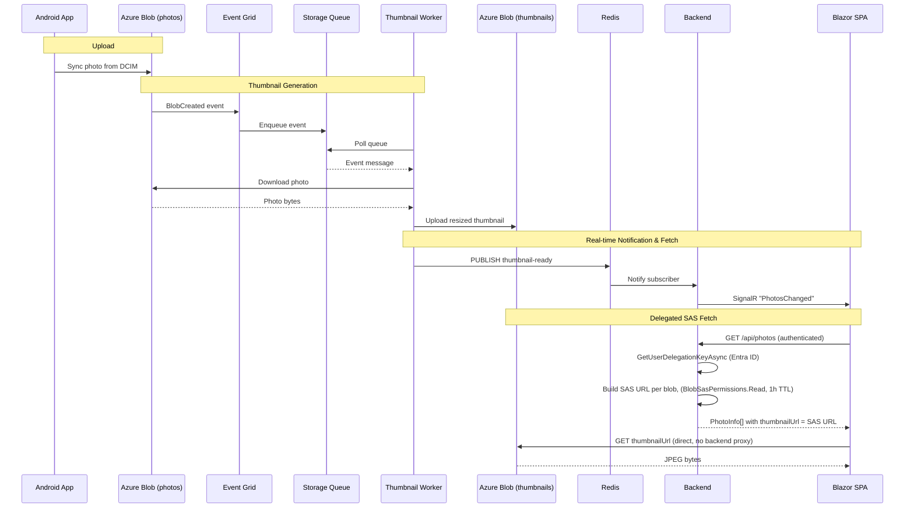
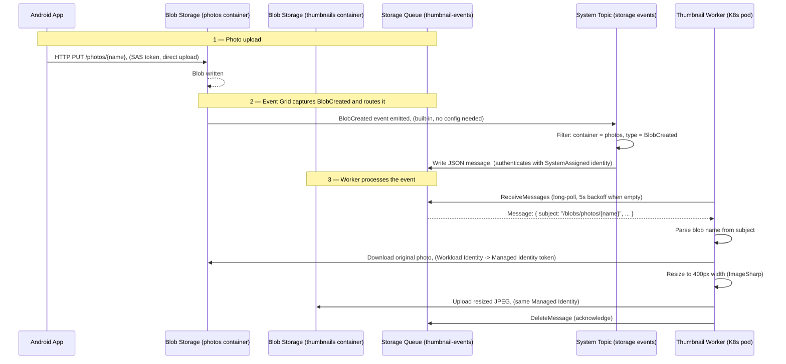
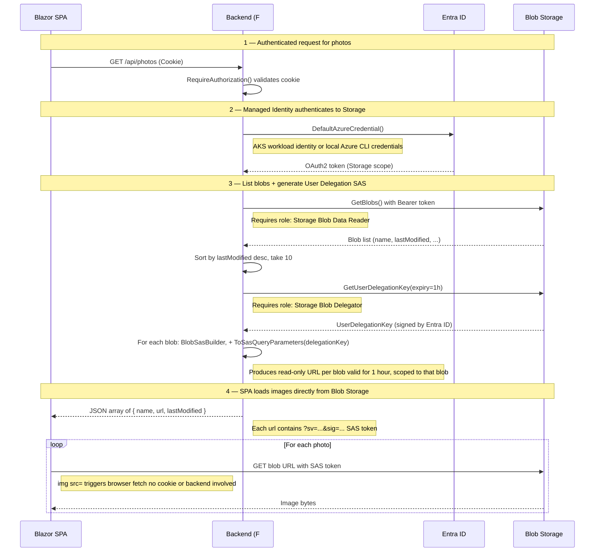
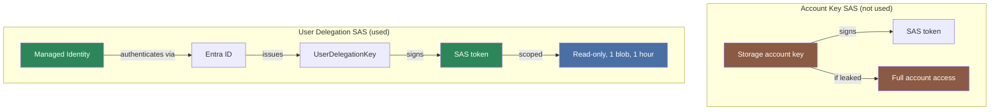

# 05 — Photo Pipeline

[Home](../README.md) · [Diagrams](diagrams.md) · [Authentication](04-auth.md) · [Infrastructure](06-infrastructure.md)

**Source files:**
[src/thumbnail-worker/ThumbnailProcessor.fs](../src/thumbnail-worker/ThumbnailProcessor.fs) ·
[src/photo-api/ThumbnailSubscriber.fs](../src/photo-api/ThumbnailSubscriber.fs) ·
[src/photo-api/Storage.fs](../src/photo-api/Storage.fs) ·
[src/photo-api/PhotoHub.fs](../src/photo-api/PhotoHub.fs)

---

## Full event flow



## Azure Storage event routing



---

## Worker startup — catch-up scan

On startup the worker runs a catch-up scan before entering the poll loop:

```
1. List all blobs in the photos container
2. For each photo with no matching thumbnail in the thumbnails container:
   a. Download the photo
   b. Resize and upload the thumbnail
3. If any thumbnails were generated, publish "thumbnail-ready catch-up" to Redis
```

This ensures photos uploaded while the worker was offline get thumbnails
without needing to re-trigger Event Grid.

---

## Delegated SAS fetch

No storage account keys are used. The backend authenticates with its Managed
Identity and issues short-lived **User Delegation SAS** tokens.



### Account key SAS vs User Delegation SAS



| Property | Value |
|----------|-------|
| No secrets in config | Only `Storage:AccountName` — no keys or connection strings |
| Least privilege | SAS grants read-only access to a single blob |
| Short-lived | SAS expires after 1 hour |
| Revocable | Removing the managed identity's RBAC stops new SAS tokens immediately |
| No proxy | Images are served directly from Blob Storage to the browser |

---

## Identity summary

Three separate identities are involved in the pipeline — none use keys.

| Identity | Used by | Roles |
|----------|---------|-------|
| Event Grid SystemAssigned | Event Grid → Queue | `Storage Queue Data Message Sender` |
| `longevity-backend-identity` | Backend pod | `Blob Data Contributor`, `Blob Delegator` |
| `longevity-thumbnail-worker-identity` | Worker pod | `Blob Data Contributor`, `Queue Data Message Processor` |

Bicep modules: [modules/photo-events.bicep](../infra/azure/modules/photo-events.bicep) ·
[modules/storage.bicep](../infra/azure/modules/storage.bicep) ·
[modules/workload-identity.bicep](../infra/azure/modules/workload-identity.bicep)

---

Next: [06 — Infrastructure](06-infrastructure.md)
