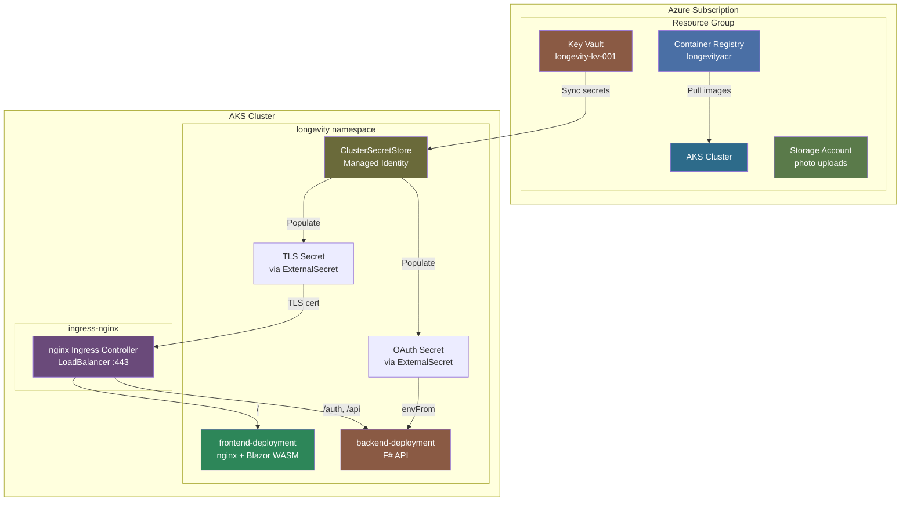
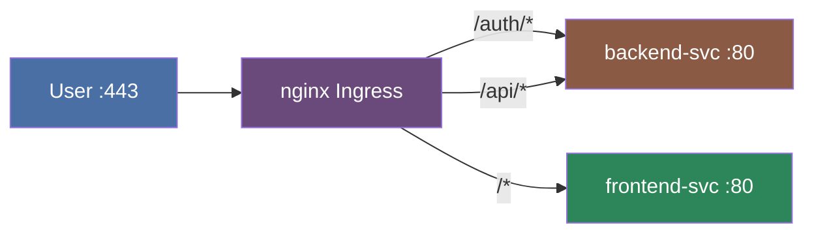

# 06 — Infrastructure

[Docs Home](README.md) · [Diagrams](diagrams.md) · [Photo Pipeline](05-photo-pipeline.md) · [Workload Identity](07-workload-identity.md)

**Source:** [infra/azure](../infra/azure) · [infra/k8s](../infra/k8s) · [infra/scripts](../infra/scripts)

---

## Azure resources

---

## Bicep modules

**Entry point:** [infra/azure/main.bicep](../infra/azure/main.bicep)  
**Parameters:** [infra/azure/main.parameters.json](../infra/azure/main.parameters.json)

| Module | File | Owns |
|--------|------|------|
| Container Registry | [modules/acr.bicep](../infra/azure/modules/acr.bicep) | ACR resource |
| ACR pull assignment | [modules/acr-pull-assignment.bicep](../infra/azure/modules/acr-pull-assignment.bicep) | `AcrPull` role for AKS kubelet identity |
| AKS Cluster | [modules/aks.bicep](../infra/azure/modules/aks.bicep) | AKS cluster, OIDC issuer, Workload Identity webhook |
| Key Vault | [modules/keyvault.bicep](../infra/azure/modules/keyvault.bicep) | Key Vault + access policies |
| Storage | [modules/storage.bicep](../infra/azure/modules/storage.bicep) | Storage account, blob containers (`photos`, `thumbnails`), queue (`thumbnail-events`), RBAC for backend + worker identities |
| Event Grid | [modules/photo-events.bicep](../infra/azure/modules/photo-events.bicep) | Event Grid system topic, event subscription, SystemAssigned → Queue RBAC |
| Workload Identity | [modules/workload-identity.bicep](../infra/azure/modules/workload-identity.bicep) | Reusable: managed identity + AKS federated credential. Used for backend and worker. |
| Log Analytics | [modules/log-analytics.bicep](../infra/azure/modules/log-analytics.bicep) | Log Analytics workspace |
| App Insights | [modules/app-insights.bicep](../infra/azure/modules/app-insights.bicep) | Application Insights component |
| Workbook | [modules/workbook.bicep](../infra/azure/modules/workbook.bicep) | Azure Monitor workbook |

---

## Ingress routing

nginx Ingress routes all traffic at `longevity.eastus2.cloudapp.azure.com`:

| Path prefix | Backend service | Target port |
|-------------|----------------|-------------|
| `/auth/*` | `backend-svc` | 8080 |
| `/api/*` | `backend-svc` | 8080 |
| `/hubs/*` | `backend-svc` | 8080 (WebSocket) |
| `/*` | `frontend-svc` | 80 |

Rate limiting (configured in [values.yaml](../infra/k8s/web-helm-chart/values.yaml)):
120 req/s, burst × 3, max 200 connections per IP.

---

## Helm chart

**Chart:** [infra/k8s/web-helm-chart](../infra/k8s/web-helm-chart)  
**Values:** [values.yaml](../infra/k8s/web-helm-chart/values.yaml)

The chart deploys all in-cluster services into the `longevity` namespace:

| Component | Kind | Image |
|-----------|------|-------|
| `web` | Deployment | `longevityacr.azurecr.io/web` |
| `photo-api` | Deployment | `longevityacr.azurecr.io/photo-api` |
| `thumbnail-worker` | Deployment | `longevityacr.azurecr.io/thumbnail-worker` |
| `redis` | StatefulSet / Deployment | Redis |
| `postgres` | StatefulSet | PostgreSQL |

Secrets are injected from Key Vault via **ExternalSecret Operator**:
- `web-tls` — TLS certificate for nginx ingress
- OAuth credentials — mounted as environment variables into the backend pod

---

## Cluster add-ons

| Add-on | Namespace | Purpose |
|--------|-----------|---------|
| [ingress-nginx](../infra/k8s/ingress-nginx/values.yaml) | `ingress-nginx` | LoadBalancer + TLS termination |
| cert-manager | `cert-manager` | Automatic Let's Encrypt TLS certificates |
| [ClusterIssuer](../infra/k8s/cert-manager/cluster-issuer.yaml) | cluster-wide | Let's Encrypt ACME issuer |
| [ClusterSecretStore](../infra/k8s/external-secrets/cluster-secret-store.yaml) | `longevity` | ExternalSecret Operator → Key Vault |
| Container Insights | kube-system | AKS log collection → Log Analytics |

---

Next: [07 — Workload Identity](07-workload-identity.md)
