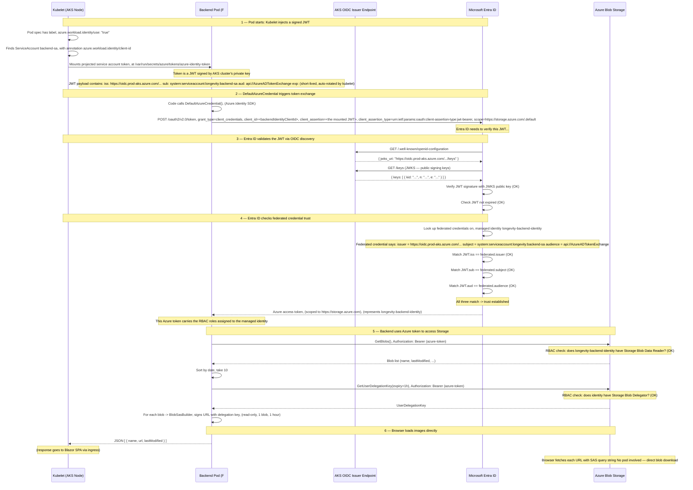
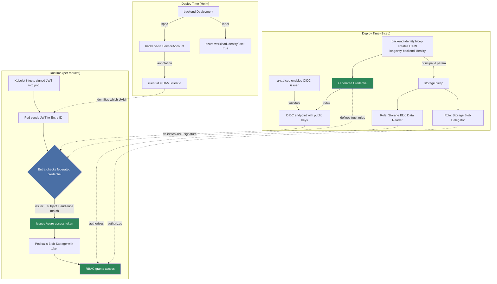
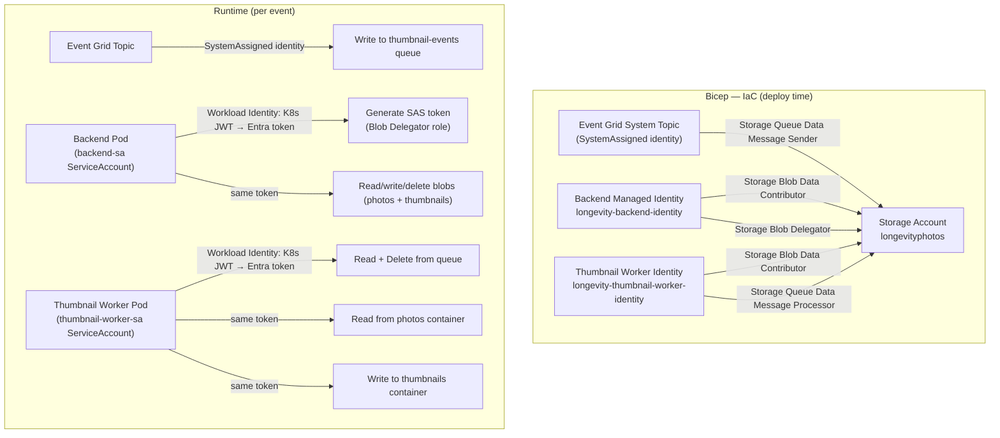

# 07 — Workload Identity

[Docs Home](README.md) · [Diagrams](diagrams.md) · [Infrastructure](06-infrastructure.md) · [Observability](08-observability.md)

**Source:** [modules/workload-identity.bicep](../infra/azure/modules/workload-identity.bicep) ·
[modules/aks.bicep](../infra/azure/modules/aks.bicep) ·
[infra/k8s/web-helm-chart/values.yaml](../infra/k8s/web-helm-chart/values.yaml)

Both the backend and thumbnail worker access Azure Storage **without any
secrets** — no connection strings, no service principal passwords, no storage
keys. AKS Workload Identity exchanges a Kubernetes-signed JWT for an Azure
access token at runtime.

---

## Full token exchange flow

---

## Trust chain

---

## Identity and RBAC wiring

---

## RBAC roles

### Backend identity (`longevity-backend-identity`)

| Role | Scope | Purpose |
|------|-------|---------|
| Storage Blob Data Reader | Storage account | List and read blob content |
| Storage Blob Delegator | Storage account | Request user delegation keys for SAS signing |

### Worker identity (`longevity-thumbnail-worker-identity`)

| Role | Scope | Purpose |
|------|-------|---------|
| Storage Blob Data Contributor | Storage account | Read photos, write thumbnails |
| Storage Queue Data Message Processor | Storage account | Receive and delete queue messages |

### Event Grid SystemAssigned identity

| Role | Scope | Purpose |
|------|-------|---------|
| Storage Queue Data Message Sender | Storage account | Write to `thumbnail-events` queue |

---

## What each component contributes

| Component | Resource | Contribution |
|-----------|----------|--------------|
| `aks.bicep` | `oidcIssuerProfile: { enabled: true }` | OIDC endpoint for JWT verification |
| `aks.bicep` | `workloadIdentity: { enabled: true }` | Mutating webhook that injects tokens into pods |
| `workload-identity.bicep` | UAMI + federated credential | Azure identity + trust link |
| `storage.bicep` | Role assignments | Permissions scoped exactly to what each identity needs |
| `values.yaml` | `workloadIdentityClientId` | Passes UAMI client ID into the Helm chart |
| `backend-sa` ServiceAccount | `client-id` annotation | Tells kubelet which UAMI to project |
| Deployment label | `azure.workload.identity/use: "true"` | Triggers token injection |

---

## Security properties

| Property | Detail |
|----------|--------|
| No secrets in cluster | No connection strings, keys, or service principal passwords anywhere |
| Per-pod isolation | Only `backend-sa` and `thumbnail-worker-sa` are federated — frontend pod cannot exchange |
| Short-lived tokens | Kubelet auto-rotates the mounted JWT; Azure token has ~1h lifetime |
| Least privilege | Each identity holds exactly the roles it needs — nothing more |
| Revocable | Remove the federated credential or RBAC role → access stops for new tokens immediately |
| No proxy | Images flow directly from Blob Storage to the browser via SAS URLs |

---

Next: [08 — Observability](08-observability.md)
