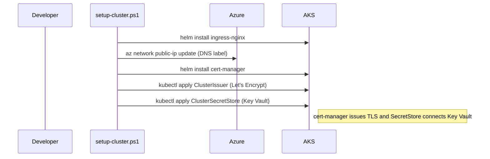
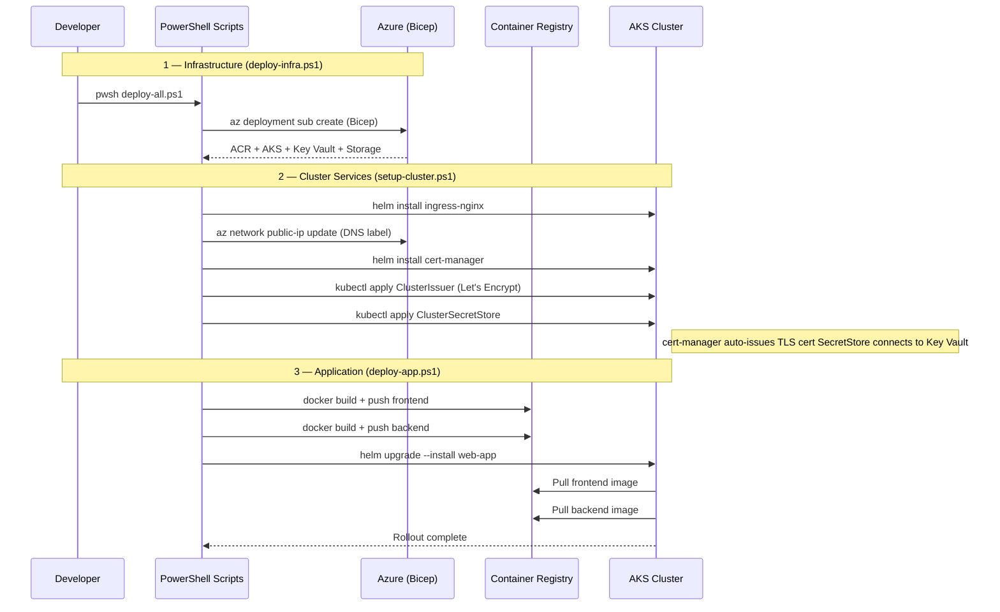

# 09 — Deployment

[Home](../README.md) · [Diagrams](diagrams.md) · [Observability](08-observability.md) · [Local Development](10-local-development.md)

**Source:** [infra/scripts](../infra/scripts)

---

## Prerequisites

- Azure CLI (`az login`) with Contributor on the target subscription
- `kubectl` configured or managed by the deploy script
- Docker (for building and pushing container images)
- PowerShell 7+ (`pwsh`)
- Helm 3

---

## Full deployment (first time or full re-deploy)

```powershell
pwsh infra/scripts/deploy-all.ps1
```

This runs all three stages in order. You can skip stages you've already done:

```powershell
pwsh infra/scripts/deploy-all.ps1 -SkipInfra           # skip Azure resources
pwsh infra/scripts/deploy-all.ps1 -SkipCluster          # skip cluster add-ons
pwsh infra/scripts/deploy-all.ps1 -SkipApp              # skip image build + Helm
pwsh infra/scripts/deploy-all.ps1 -Tag v1.2.3           # pin a specific image tag
pwsh infra/scripts/deploy-all.ps1 -IncludeIngress       # redeploy ingress-nginx too
```

---

## Stage 1 — Azure infrastructure

```powershell
pwsh infra/scripts/azure/deploy-infra.ps1
```

Runs `az deployment sub create` with
[infra/azure/main.bicep](../infra/azure/main.bicep) and
[infra/azure/main.parameters.json](../infra/azure/main.parameters.json).

Deploys: ACR · AKS (with OIDC + Workload Identity) · Key Vault · Storage Account ·
Event Grid topic + subscription · Managed Identities · RBAC assignments ·
Log Analytics · App Insights · Monitor Workbook.

---

## Stage 2 — Cluster add-ons

```powershell
pwsh infra/scripts/cluster/setup-cluster.ps1
```



After this stage: the nginx ingress controller is running, TLS certificate
issuance is configured, and Key Vault secrets will sync to the cluster.

---

## Stage 3 — Application

```powershell
pwsh infra/scripts/app/deploy-app.ps1
```

Or deploy individual services:

```powershell
pwsh infra/scripts/app/deploy-backend.ps1
pwsh infra/scripts/app/deploy-frontend.ps1
pwsh infra/scripts/app/deploy-worker.ps1
```

Each script:
1. Builds the Docker image (`linux/amd64`)
2. Pushes to ACR (`longevityacr.azurecr.io/<service>:<tag>`)
3. Runs `helm upgrade --install web-app infra/k8s/web-helm-chart`

After deployment, check the ingress external IP:

```powershell
kubectl get svc -n ingress-nginx
```

---

## Deploy workbook only

```powershell
pwsh infra/scripts/azure/deploy-workbook.ps1
```

Compiles the YAML workbook definition and deploys it to Azure Monitor.

---

## Deployment pipeline diagram



---

Next: [10 — Local Development](10-local-development.md)
