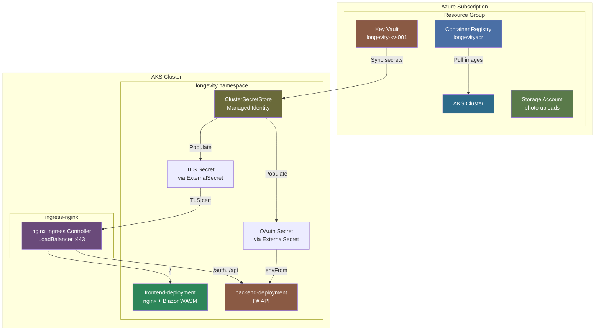
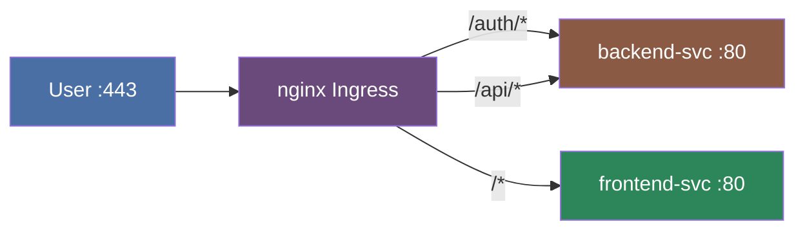

# Infrastructure

## Azure Resources



## Deployment Pipeline

```mermaid
sequenceDiagram
    participant Dev as Developer
    participant Script as PowerShell Scripts
    participant Az as Azure (Bicep)
    participant ACR as Container Registry
    participant K8s as AKS Cluster

    rect rgb(60, 40, 60)
    Note over Dev,Az: 1 — Infrastructure (deploy-infra.ps1)

    Dev->>Script: pwsh deploy-all.ps1
    Script->>Az: az deployment sub create (Bicep)
    Az-->>Script: ACR + AKS + Key Vault + Storage
    end

    rect rgb(40, 50, 60)
    Note over Dev,K8s: 2 — Cluster Services (setup-cluster.ps1)

    Script->>K8s: helm install ingress-nginx
    Script->>Az: az network public-ip update (DNS label)
    Script->>K8s: helm install cert-manager
    Script->>K8s: kubectl apply ClusterIssuer (Let's Encrypt)
    Script->>K8s: kubectl apply ClusterSecretStore
    Note right of K8s: cert-manager auto-issues TLS cert<br/>SecretStore connects to Key Vault
    end

    rect rgb(60, 50, 40)
    Note over Dev,K8s: 3 — Application (deploy-app.ps1)

    Script->>ACR: docker build + push frontend
    Script->>ACR: docker build + push backend
    Script->>K8s: helm upgrade --install web-app
    K8s->>ACR: Pull frontend image
    K8s->>ACR: Pull backend image
    K8s-->>Script: Rollout complete
    end
```



## Ingress Routing



| Path | Service | Port | Target |
|------|---------|------|--------|
| `/auth/*` | backend-svc | 80 → 8080 | F# API |
| `/api/*` | backend-svc | 80 → 8080 | F# API |
| `/*` | frontend-svc | 80 → 80 | nginx (Blazor) |

## Deploy everything

```powershell
pwsh scripts/deploy-all.ps1
```

## Deploy individually

```powershell
pwsh scripts/deploy-infra.ps1
pwsh scripts/setup-cluster.ps1
pwsh scripts/deploy-app.ps1
```

## Prerequisites

- Azure CLI (`az login`)
- kubectl
- Helm 3
- Docker

## Runtime Config

The deployment scripts require these values at runtime:

- `DnsLabel`
- `IngressHostname`
- `CertEmail`

Fill in `infra/scripts/runtime.parameters.json` (gitignored — never committed):

```json
{
    "dnsLabel": "REPLACE_ME",
    "ingressHostname": "REPLACE_ME",
    "certEmail": "REPLACE_ME"
}
```

## Related READMEs

- [Project Root](../README.md)
- [Backend](../longevity-backend/README.md)
- [Frontend](../longevity-frontend/README.md)
