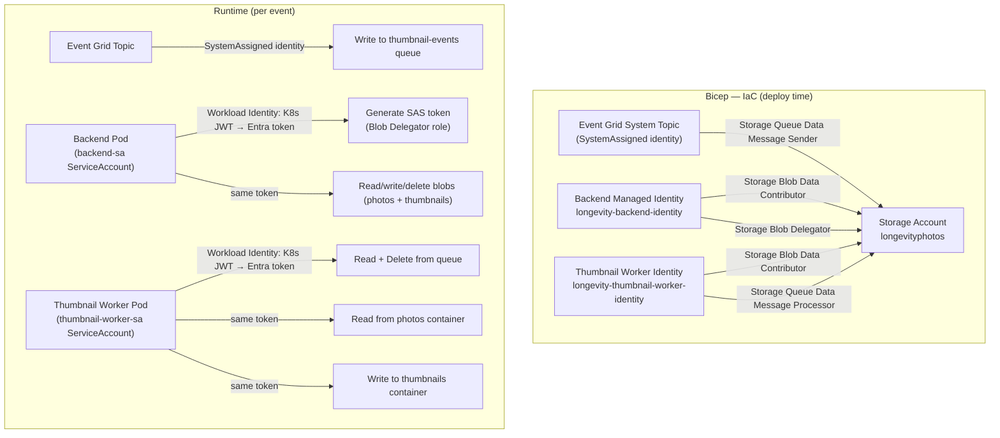

# Azure Infrastructure

## Photo Thumbnail Pipeline

When a photo is uploaded to Blob Storage, a thumbnail is generated automatically
without any polling. This document explains how the events flow and how each
component authenticates.

### Event Flow

```mermaid
sequenceDiagram
    box rgb(180,220,255) Mobile
    participant Phone as Android App
    end
    box rgb(255,210,180) Azure Storage
    participant Blob as Blob Storage<br/>(photos container)
    participant Thumbs as Blob Storage<br/>(thumbnails container)
    participant Queue as Storage Queue<br/>(thumbnail-events)
    end
    box rgb(220,180,255) Azure Event Grid
    participant Topic as System Topic<br/>(storage events)
    end
    box rgb(180,255,200) Kubernetes
    participant Worker as Thumbnail Worker<br/>(K8s pod)
    end

    rect rgb(40,40,60)
    Note over Phone,Queue: 1 — Photo upload

    Phone->>Blob: HTTP PUT /photos/{name}<br/>(SAS token, direct upload)
    Blob-->>Blob: Blob written
    end

    rect rgb(40,40,60)
    Note over Blob,Queue: 2 — Event Grid captures BlobCreated and routes it

    Blob->>Topic: BlobCreated event emitted<br/>(built-in, no config needed)
    Topic->>Topic: Filter: container = photos, type = BlobCreated
    Topic->>Queue: Write JSON message<br/>(authenticates with SystemAssigned identity)
    end

    rect rgb(40,40,60)
    Note over Queue,Thumbs: 3 — Worker processes the event

    Worker->>Queue: ReceiveMessages (long-poll, 5s backoff when empty)
    Queue-->>Worker: Message: { subject: "/blobs/photos/{name}", ... }
    Worker->>Worker: Parse blob name from subject
    Worker->>Blob: Download original photo<br/>(Workload Identity → Managed Identity token)
    Worker->>Worker: Resize to 400px width (ImageSharp)
    Worker->>Thumbs: Upload resized JPEG<br/>(same Managed Identity)
    Worker->>Queue: DeleteMessage (acknowledge)
    end
```

### Auth Flow

Three separate identities are involved. None use connection strings or keys.

### Why three identities?

| Identity | ServiceAccount | Roles |
|---|---|---|
| Event Grid System Topic | Azure-managed | Storage Queue Data Message Sender |
| `longevity-backend-identity` | `backend-sa` | Blob Data Contributor, Blob Delegator |
| `longevity-thumbnail-worker-identity` | `thumbnail-worker-sa` | Blob Data Contributor, Queue Data Message Processor |

Event Grid uses its own `SystemAssigned` identity — it cannot use your workload
identity. It is granted only the `Queue Data Message Sender` role.

The backend needs `Blob Delegator` to issue user-delegation SAS tokens for
direct mobile uploads, but has no queue access. The worker needs queue access
to consume events, but never needs to issue SAS tokens. Each identity holds
exactly the permissions it requires — nothing more.

### Module breakdown

| Module | Owns |
|---|---|
| `modules/storage.bicep` | Storage account, blob containers, queue, backend + worker RBAC |
| `modules/photo-events.bicep` | Event Grid system topic, event subscription, topic → queue RBAC |
| `modules/workload-identity.bicep` | Generic reusable module: managed identity + AKS federated credential. Used for both `backend-sa` and `worker-sa` (and any future workload). |
