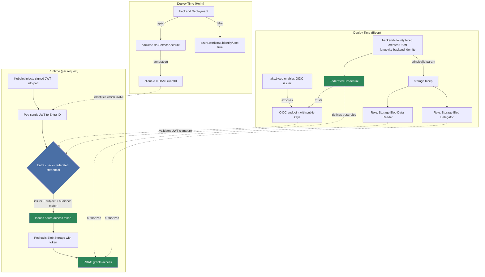

# Longevity Helm Chart

## Security — AKS Workload Identity

The backend pod accesses Azure Blob Storage **without any secrets**.
Instead, AKS Workload Identity uses a chain of trust to exchange a
Kubernetes token for an Azure access token at runtime.

### Full Token Exchange Flow

```mermaid
sequenceDiagram
    box rgb(180,220,255) Kubernetes
    participant Kubelet as Kubelet<br/>(AKS Node)
    participant Pod as Backend Pod<br/>(F# API)
    end
    box rgb(255,210,180) Azure Identity
    participant OIDC as AKS OIDC<br/>Issuer Endpoint
    participant Entra as Microsoft<br/>Entra ID
    end
    box rgb(180,255,200) Azure Resources
    participant Blob as Azure Blob<br/>Storage
    end

    rect rgb(40, 40, 60)
    Note over Kubelet,Entra: 1 — Pod starts: Kubelet injects a signed JWT

    Kubelet->>Kubelet: Pod spec has label<br/>azure.workload.identity/use: "true"
    Kubelet->>Kubelet: Finds ServiceAccount backend-sa<br/>with annotation azure.workload.identity/client-id
    Kubelet->>Pod: Mounts projected service account token<br/>at /var/run/secrets/azure/tokens/azure-identity-token
    Note over Pod: Token is a JWT signed by AKS cluster's private key

    Note over Pod: JWT payload contains:<br/>iss: https://oidc.prod-aks.azure.com/…<br/>sub: system:serviceaccount:longevity:backend-sa<br/>aud: api://AzureADTokenExchange<br/>exp: (short-lived, auto-rotated by kubelet)
    end

    rect rgb(40, 60, 40)
    Note over Kubelet,Entra: 2 — DefaultAzureCredential triggers token exchange

    Pod->>Pod: Code calls DefaultAzureCredential()<br/>(Azure.Identity SDK)
    Pod->>Entra: POST /oauth2/v2.0/token<br/>grant_type=client_credentials<br/>client_id=<backendIdentityClientId><br/>client_assertion=<the mounted JWT><br/>client_assertion_type=urn:ietf:params:oauth:client-assertion-type:jwt-bearer<br/>scope=https://storage.azure.com/.default

    Note over Entra: Entra ID needs to verify this JWT…
    end

    rect rgb(60, 40, 40)
    Note over Kubelet,Entra: 3 — Entra ID validates the JWT via OIDC discovery

    Entra->>OIDC: GET /.well-known/openid-configuration
    OIDC-->>Entra: { jwks_uri: "https://oidc.prod-aks.azure.com/…/keys" }

    Entra->>OIDC: GET /keys (JWKS — public signing keys)
    OIDC-->>Entra: { keys: [ { kid: "…", n: "…", e: "…" } ] }

    Entra->>Entra: Verify JWT signature with JWKS public key ✓
    Entra->>Entra: Check JWT not expired ✓
    end

    rect rgb(50, 40, 60)
    Note over Kubelet,Entra: 4 — Entra ID checks federated credential trust

    Entra->>Entra: Look up federated credentials on<br/>managed identity longevity-backend-identity

    Note over Entra: Federated credential says:<br/>issuer = https://oidc.prod-aks.azure.com/…<br/>subject = system:serviceaccount:longevity:backend-sa<br/>audience = api://AzureADTokenExchange

    Entra->>Entra: Match JWT.iss == federated.issuer ✓
    Entra->>Entra: Match JWT.sub == federated.subject ✓
    Entra->>Entra: Match JWT.aud == federated.audience ✓

    Note over Entra: All three match → trust established

    Entra-->>Pod: Azure access token<br/>(scoped to https://storage.azure.com)<br/>(represents longevity-backend-identity)

    Note over Pod: This Azure token carries the RBAC roles<br/>assigned to the managed identity
    end

    rect rgb(40, 50, 60)
    Note over Pod,Blob: 5 — Backend uses Azure token to access Storage

    Pod->>Blob: GetBlobs()<br/>Authorization: Bearer <azure-token>
    Note over Blob: RBAC check: does longevity-backend-identity<br/>have Storage Blob Data Reader? ✓
    Blob-->>Pod: Blob list (name, lastModified, …)

    Pod->>Pod: Sort by date, take 10

    Pod->>Blob: GetUserDelegationKey(expiry=1h)<br/>Authorization: Bearer <azure-token>
    Note over Blob: RBAC check: does identity<br/>have Storage Blob Delegator? ✓
    Blob-->>Pod: UserDelegationKey

    Pod->>Pod: For each blob → BlobSasBuilder<br/>signs URL with delegation key<br/>(read-only, 1 blob, 1 hour)
    end

    rect rgb(60, 50, 40)
    Note over Pod,Blob: 6 — Browser loads images directly

    Pod-->>Kubelet: JSON [ { name, url, lastModified } ]
    Note over Kubelet: (response goes to Blazor SPA via ingress)

    Note over Blob: Browser fetches each URL with SAS query string<br/>No pod involved — direct blob download
    end
```

### Trust Chain Summary

### Security Properties

| Property | Detail |
|----------|--------|
| **No secrets in cluster** | No connection strings, storage keys, or service principal passwords. The only config value is a public client ID |
| **Per-pod isolation** | Only `backend-sa` is federated. The frontend pod (default SA) cannot exchange for this identity |
| **Short-lived tokens** | The mounted JWT is auto-rotated by kubelet. The Azure token has a ~1h lifetime. SAS URLs expire after 1h |
| **Least privilege** | The identity has exactly 2 roles: `Blob Data Reader` (list/read) + `Blob Delegator` (sign SAS). No write, no delete, no other services |
| **Revocable** | Remove the federated credential or RBAC → access stops immediately for new tokens |
| **No proxy** | Images are served directly from Blob Storage to the browser via SAS URLs. The backend is never in the data path |

### RBAC Roles Assigned to `longevity-backend-identity`

| Role | Role ID | Scope | Grants |
|------|---------|-------|--------|
| Storage Blob Data Reader | `2a2b9908-6ea1-4ae2-8e65-a410df84e7d1` | Storage account | List containers and blobs, read blob content |
| Storage Blob Delegator | `db58b8e5-c6ad-4a2a-8342-4190687cbf4a` | Storage account | Request user delegation keys for SAS signing |

### What Each Component Contributes

| Component | Resource | What it provides |
|-----------|----------|------------------|
| **aks.bicep** | `oidcIssuerProfile: { enabled: true }` | OIDC endpoint that publishes signing keys for JWT verification |
| **aks.bicep** | `workloadIdentity: { enabled: true }` | Mutating webhook that injects tokens into annotated pods |
| **backend-identity.bicep** | `backendIdentity` (UAMI) | The Azure identity the pod assumes |
| **backend-identity.bicep** | `federatedCredential` | Trust link: AKS issuer + `backend-sa` subject → this UAMI |
| **storage.bicep** | `blobDataReader` role | Permission to list and read blobs (assigned via `backendPrincipalId` param) |
| **storage.bicep** | `blobDelegator` role | Permission to get delegation keys for SAS signing (assigned via `backendPrincipalId` param) |
| **values.yaml** | `backend.workloadIdentityClientId` | Passes the UAMI client ID into the Helm chart |
| **backend-sa** | ServiceAccount | Carries the `client-id` annotation kubelet reads |
| **backend deployment** | `azure.workload.identity/use: "true"` label | Triggers the mutating webhook to inject the projected token volume |
