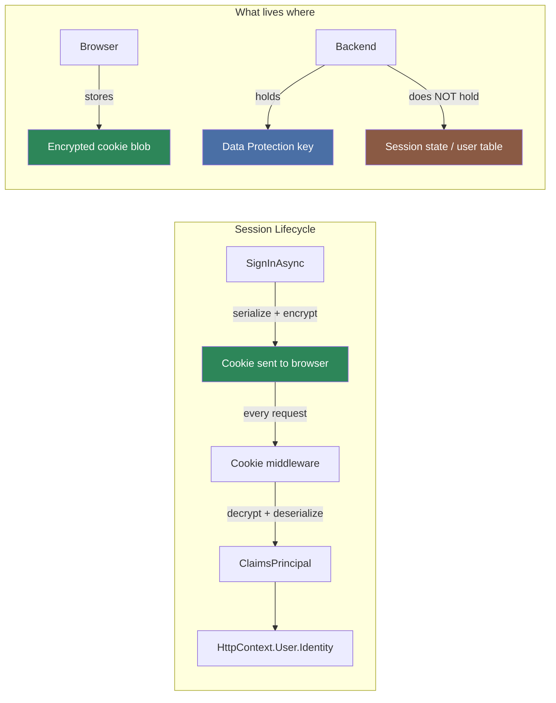
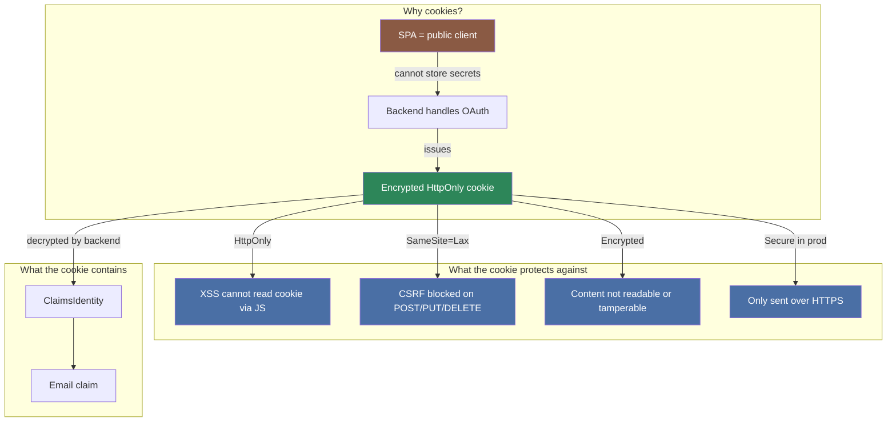

# Longevity Backend

F# / ASP.NET Core minimal API.

## Google OAuth 2.0 Flow

```mermaid
sequenceDiagram
    box rgb(170,255,200) SPA
    participant SPA as Blazor SPA (Browser)
    end
    box rgb(255,180,180) Backend
    participant App as Backend (F# API)
    end
    participant Google as Google OAuth

    Note over SPA: Blazor WebAssembly single-page app running client-side

    rect rgb(40, 40, 60)
    Note over SPA,Google: 1 - Login and Consent

    SPA->>App: GET /auth/login
    App-->>SPA: 302 Redirect to Google

    Note right of App: query params - client_id, redirect_uri, scope=openid email, response_type=code

    SPA->>Google: Browser follows redirect
    Google-->>SPA: Consent screen
    SPA->>Google: Approves access
    Google-->>SPA: 302 redirect to /auth/callback?code=AUTH_CODE
    end

    rect rgb(40, 60, 40)
    Note over SPA,Google: 2 - Token Exchange (server-side)

    SPA->>App: GET /auth/callback?code=AUTH_CODE

    App->>Google: POST /token
    Note right of App: body - auth_code, client_id, client_secret, redirect_uri, grant_type

    Google-->>App: { access_token (Bearer) }
    Note right of App: access_token is short-lived (~1 hour, Google default)
    end

    rect rgb(60, 40, 40)
    Note over SPA,Google: 3 - Session Creation

    App->>Google: GET /userinfo
    Note right of App: Authorization header uses Bearer access_token

    Google-->>App: { email }

    alt email = AllowedEmail
        App->>App: SignInAsync(ClaimsIdentity)
        Note right of App: encrypts ClaimsIdentity (AES) into cookie - cookie IS the session
        App-->>SPA: 302 Redirect / + Set-Cookie
        Note right of App: Set-Cookie .AspNetCore.Cookies=encrypted_blob, HttpOnly, SameSite=Lax
    else email does not match AllowedEmail
        App-->>SPA: 302 Redirect /?error=access_denied
        Note right of App: No cookie set, no session created
    end
    end

    rect rgb(40, 50, 60)
    Note over SPA,Google: 4 - Session Active (every request)

    SPA->>App: GET /auth/me (Cookie auto-attached)
    App->>App: Decrypt cookie to ClaimsIdentity
    Note right of App: cookie middleware decrypts to ClaimsPrincipal in-memory - no DB lookup
    App-->>SPA: email payload then LoginDisplay shows email

    loop Every API call
        SPA->>App: GET /api/* (Cookie auto-attached)
        Note right of SPA: Browser sends cookie automatically, JS never reads or sends it
        App->>App: Decrypt cookie to ClaimsPrincipal
        alt Session valid (cookie decrypts OK)
            App-->>SPA: 200 + resource data
        else No cookie / tampered / expired
            App-->>SPA: 401 Unauthorized
            SPA->>App: GET /auth/login (new session)
        end
    end
    end

    rect rgb(60, 50, 40)
    Note over SPA,Google: 5 - Session Destroyed (Logout)

    SPA->>App: POST /auth/logout
    App->>App: SignOutAsync expires cookie
    Note right of App: Set-Cookie with past expiry - browser deletes it, no server state
    App-->>SPA: 302 Redirect / + expired Set-Cookie
    SPA->>App: GET /auth/me returns 401 (no cookie)
    SPA->>SPA: LoginDisplay shows "Sign in" link
    end
```

## Session Model — Cookie as Session

This application has **no server-side session store** (no database, no
Redis, no in-memory dictionary). The cookie itself *is* the session.

| Question | Answer |
|----------|--------|
| **Where is the session stored?** | Inside the cookie — browser stores the encrypted blob, backend decrypts it on each request |
| **Is there a session ID?** | No. There is no server-side lookup. The cookie payload contains the full `ClaimsIdentity` |
| **What happens on restart?** | If the Data Protection key persists (default: `~/.aspnet/DataProtection-Keys`), existing cookies remain valid. If the key is lost, all sessions are invalidated |
| **How does it expire?** | ASP.NET sets a cookie expiry. After that, the browser stops sending it. No server-side cleanup needed |
| **How does logout work?** | `SignOutAsync` tells the browser to delete the cookie (Set-Cookie with past date). Nothing to delete on the server |
| **Scalability?** | Stateless — any backend instance can decrypt the cookie if they share the same Data Protection key. No sticky sessions needed |

## Cookie Security Model

The SPA runs entirely in the browser (Blazor WebAssembly) so it cannot
hold secrets — no client secret, no tokens in `localStorage`. Instead,
the backend owns the full OAuth exchange and issues an **encrypted
HttpOnly cookie** as the session credential.

| Property | Value | Why |
|----------|-------|-----|
| **HttpOnly** | `true` | Cookie is invisible to JavaScript — XSS attacks cannot steal it |
| **SameSite** | `Lax` | Browser only sends cookie to same-origin requests (blocks CSRF on mutations) |
| **Encrypted** | ASP.NET Data Protection | Cookie payload is AES-encrypted + HMAC-signed — cannot be forged or read |
| **Secure** | `true` in production | Cookie only sent over HTTPS — cannot be intercepted in transit |
| **No tokens in browser** | — | Access token + client secret stay server-side, never exposed to JS |

## Endpoints

| Method | Route | Auth | Purpose |
|--------|-------|------|---------|
| GET | `/auth/login` | — | Redirect to Google consent screen |
| GET | `/auth/callback` | — | Exchange code → set cookie → redirect `/` |
| GET | `/auth/me` | Cookie | Return `{ email }` or 401 |
| POST | `/auth/logout` | Cookie | Expire cookie → redirect `/` |
| GET | `/api/weatherforecast` | — | Sample data |

| Phase | What happens | Credential |
|-------|--------------|--------------------|
| **Login** | `GET /auth/login` → 302 to Google | — |
| **Consent** | User approves on Google | — |
| **Callback** | `GET /auth/callback?code=…` | Authorization code (one-time, ~10 min) |
| **Token exchange** | `POST googleapis.com/token` | Code → **Access token** (~1 hour) |
| **Identity** | `GET googleapis.com/userinfo` | **Bearer access_token** |
| **Cookie set** | `SignInAsync` serializes ClaimsIdentity → encrypted cookie | **Encrypted cookie** (= the session) |
| **Navigation** | Browser sends cookie on every request | **Cookie** (auto-attached, decrypted server-side) |
| **Expiry** | Cookie expires → browser stops sending → 401 | No server cleanup |
| **Logout** | `SignOutAsync` → Set-Cookie with past date | Cookie deleted (session destroyed) |

## Related READMEs

- [Project Root](../README.md)
- [Frontend](../longevity-frontend/README.md)
- [Infrastructure](../infra/README.md)
