# Longevity Backend

F# / ASP.NET Core minimal API.

## Google OAuth 2.0 Flow

```mermaid
sequenceDiagram
    participant SPA as Blazor SPA (Browser)
    participant App as Backend (F# API)
    participant Google as Google OAuth

    Note over SPA: Blazor WebAssembly<br/>single-page application<br/>running client-side

    rect rgb(40, 40, 60)
    Note over SPA,Google: 1 — Login & Consent

    SPA->>App: GET /auth/login
    App-->>SPA: 302 Redirect to Google

    Note right of App: query: client_id,<br/>redirect_uri,<br/>scope=openid email,<br/>response_type=code

    SPA->>Google: Browser follows redirect
    Google-->>SPA: Consent screen
    SPA->>Google: Approves access
    Google-->>SPA: 302 → /auth/callback?code=AUTH_CODE
    end

    rect rgb(40, 60, 40)
    Note over SPA,Google: 2 — Token Exchange (server-side)

    SPA->>App: GET /auth/callback?code=AUTH_CODE

    App->>Google: POST /token
    Note right of App: body: auth_code +<br/>client_id + client_secret +<br/>redirect_uri + grant_type

    Google-->>App: { access_token (Bearer) }
    Note right of App: access_token is short-lived<br/>(~1 hour, Google default)
    end

    rect rgb(60, 40, 40)
    Note over SPA,Google: 3 — Identity Verification

    App->>Google: GET /userinfo
    Note right of App: Authorization:<br/>Bearer access_token

    Google-->>App: { email }

    alt email = AllowedEmail
        App-->>SPA: 200 + Set-Cookie: session JWT
        Note right of App: JWT contains email +<br/>expiry (~24 h)
    else email ≠ AllowedEmail
        App-->>SPA: 403 Denied
    end
    end

    rect rgb(40, 50, 60)
    Note over SPA,Google: 4 — Authenticated Session

    loop Every page navigation / API call
        SPA->>App: GET /api/* (Cookie: session JWT)
        Note right of SPA: Blazor SPA sends cookie<br/>automatically with each request
        App->>App: Validate JWT signature + expiry
        alt JWT valid
            App-->>SPA: 200 + resource data
        else JWT expired
            App-->>SPA: 401 Unauthorized
            SPA->>App: GET /auth/login (restart flow)
        end
    end
    end

    rect rgb(60, 50, 40)
    Note over SPA,Google: 5 — Logout & Revocation

    SPA->>App: POST /auth/logout
    App->>App: Clear session cookie
    App-->>SPA: 200 + Set-Cookie: (expired)

    Note over SPA,App: Optional: revoke Google token
    App->>Google: POST /revoke?token=access_token
    Google-->>App: 200 OK
    Note right of Google: Google access revoked —<br/>next login requires<br/>consent again
    end
```

| Phase | What happens | Token / Credential |
|-------|--------------|--------------------|
| **Login** | `GET /auth/login` → 302 to Google | — |
| **Consent** | User approves on Google | — |
| **Callback** | `GET /auth/callback?code=…` | Authorization code (one-time, ~10 min) |
| **Token exchange** | `POST googleapis.com/token` | Code → **Access token** (~1 hour) |
| **Identity** | `GET googleapis.com/userinfo` | **Bearer access_token** |
| **Session start** | Backend sets cookie | **Session JWT** (~24 hours) |
| **Navigation** | Browser sends cookie on every request | **Session JWT** (auto-attached) |
| **Expiry** | JWT expires → 401 | Must re-authenticate |
| **Logout** | Clear cookie, optionally revoke at Google | Cookie deleted, Google token revoked |
