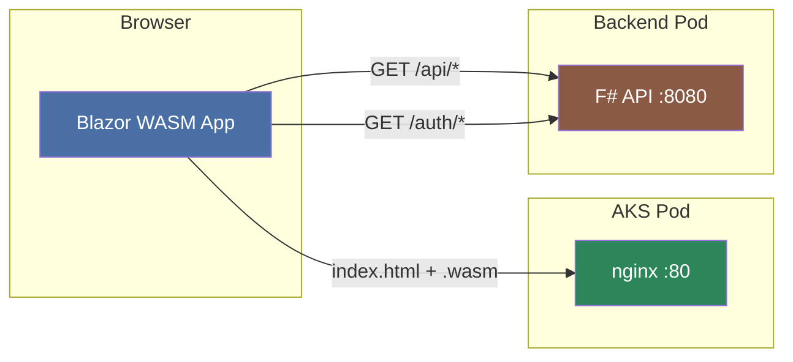

# Longevity Frontend

Blazor WebAssembly SPA served via nginx.

## Architecture



## Request Flow

```mermaid
sequenceDiagram
    participant SPA as Blazor SPA (Browser)
    participant Ingress as nginx Ingress
    participant Files as Static Files (nginx)
    participant BE as Backend Pod (F# API)

    Note over SPA: Single-page application<br/>running client-side in browser

    rect rgb(40, 60, 40)
    Note over SPA,Files: Initial Page Load

    SPA->>Ingress: GET /
    Ingress->>Files: Route to frontend-svc
    Files-->>SPA: index.html + Blazor WASM bundle
    Note right of Files: ~5 MB first load<br/>.NET runtime + app DLLs
    SPA->>SPA: Blazor initializes in browser
    end

    rect rgb(40, 40, 60)
    Note over SPA,BE: Client-Side Navigation

    SPA->>SPA: Click "Weather" tab
    Note right of SPA: Blazor handles routing<br/>client-side (no server roundtrip)
    SPA->>Ingress: GET /api/weatherforecast
    Ingress->>BE: Route to backend-svc
    BE-->>SPA: JSON forecast array
    SPA->>SPA: Blazor renders table
    end

    rect rgb(60, 40, 40)
    Note over SPA,BE: Deep Link / Refresh

    SPA->>Ingress: GET /weather (browser refresh)
    Ingress->>Files: Route to frontend-svc
    Files-->>SPA: index.html (nginx try_files fallback)
    Note right of Files: nginx returns index.html<br/>for all unknown paths<br/>(SPA catch-all)
    SPA->>SPA: Blazor boots, reads /weather route
    SPA->>Ingress: GET /api/weatherforecast
    Ingress->>BE: Route to backend-svc
    BE-->>SPA: JSON data
    end
```



## Pages

| Route | Component | Data Source |
|-------|-----------|-------------|
| `/` | Home | — |
| `/counter` | Counter | Client-side state |
| `/weather` | Weather | `GET /api/weatherforecast` |

## Authentication in the SPA

The Blazor SPA is a public client — it runs entirely in the browser and
cannot hold secrets. Authentication is handled via an **encrypted
HttpOnly cookie** set by the backend after Google OAuth completes.

```mermaid
sequenceDiagram
    participant User
    participant SPA as Blazor SPA (Browser)
    participant BE as Backend (F# API)

    Note over SPA: LoginDisplay component<br/>renders in MainLayout top bar

    rect rgb(40, 40, 60)
    Note over User,BE: Check session on page load

    SPA->>SPA: LoginDisplay.OnInitializedAsync
    SPA->>SPA: AuthService.CheckAsync()
    SPA->>BE: GET /auth/me (cookie auto-attached)
    Note right of SPA: Browser sends encrypted<br/>cookie if it exists —<br/>the cookie IS the session

    alt Cookie present → session active
        BE->>BE: Decrypt cookie → ClaimsPrincipal
        BE-->>SPA: { email }
        SPA->>SPA: AuthState = (true, email)
        SPA->>User: Shows email + "Sign out"
    else No cookie → no session
        BE-->>SPA: 401
        SPA->>SPA: AuthState = (false, null)
        SPA->>User: Shows "Sign in with Google"
    end
    end

    rect rgb(40, 60, 40)
    Note over User,BE: Sign in (session created)

    User->>SPA: Clicks "Sign in with Google"
    SPA->>BE: Browser navigates to /auth/login
    Note right of SPA: Full-page navigation,<br/>not an SPA fetch —<br/>browser follows 302 chain
    BE-->>SPA: 302 → Google → consent → callback
    BE->>BE: SignInAsync → new session cookie
    Note right of BE: Session = encrypted cookie<br/>containing ClaimsIdentity.<br/>No server-side storage.
    BE-->>SPA: 302 Redirect / + Set-Cookie
    SPA->>SPA: Blazor re-initializes
    SPA->>BE: GET /auth/me (new cookie = session)
    BE-->>SPA: { email }
    SPA->>User: Shows email + "Sign out"
    end

    rect rgb(60, 40, 40)
    Note over User,BE: Sign out (session destroyed)

    User->>SPA: Clicks "Sign out"
    SPA->>BE: POST /auth/logout (form submit)
    BE->>BE: SignOutAsync → Set-Cookie: expired
    Note right of BE: Cookie deleted by browser.<br/>No server state to clean up —<br/>session simply ceases to exist.
    BE-->>SPA: 302 Redirect /
    SPA->>SPA: Blazor re-initializes
    SPA->>BE: GET /auth/me (no cookie)
    BE-->>SPA: 401
    SPA->>User: Shows "Sign in with Google"
    end
```



> **Why the SPA never touches tokens:** The access token and client
> secret stay on the backend. The browser only sees an encrypted,
> HttpOnly, SameSite=Lax cookie that JavaScript cannot read. This means
> XSS attacks cannot steal credentials — the browser attaches the
> cookie automatically, and the backend decrypts it to identify the
> user.

## Local

```powershell
dotnet run
```

## Docker

```powershell
docker compose up -d
```

http://localhost:8080