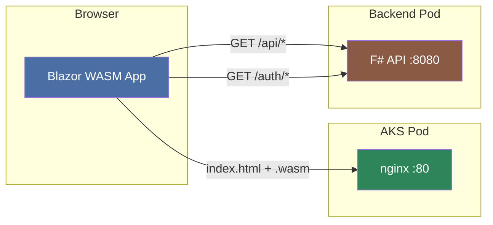

# Longevity Frontend

Blazor WebAssembly SPA served via nginx.

## Architecture



## Request Flow

```mermaid
sequenceDiagram
    participant SPA as Blazor SPA (Browser)
    participant Ingress as nginx Ingress
    participant Files as Static Files (nginx)
    participant BE as Backend Pod (F# API)

    Note over SPA: Single-page application<br/>running client-side in browser

    rect rgb(40, 60, 40)
    Note over SPA,Files: Initial Page Load

    SPA->>Ingress: GET /
    Ingress->>Files: Route to frontend-svc
    Files-->>SPA: index.html + Blazor WASM bundle
    Note right of Files: ~5 MB first load<br/>.NET runtime + app DLLs
    SPA->>SPA: Blazor initializes in browser
    end

    rect rgb(40, 40, 60)
    Note over SPA,BE: Client-Side Navigation

    SPA->>SPA: Click "Weather" tab
    Note right of SPA: Blazor handles routing<br/>client-side (no server roundtrip)
    SPA->>Ingress: GET /api/weatherforecast
    Ingress->>BE: Route to backend-svc
    BE-->>SPA: JSON forecast array
    SPA->>SPA: Blazor renders table
    end

    rect rgb(60, 40, 40)
    Note over SPA,BE: Deep Link / Refresh

    SPA->>Ingress: GET /weather (browser refresh)
    Ingress->>Files: Route to frontend-svc
    Files-->>SPA: index.html (nginx try_files fallback)
    Note right of Files: nginx returns index.html<br/>for all unknown paths<br/>(SPA catch-all)
    SPA->>SPA: Blazor boots, reads /weather route
    SPA->>Ingress: GET /api/weatherforecast
    Ingress->>BE: Route to backend-svc
    BE-->>SPA: JSON data
    end
```



## Pages

| Route | Component | Data Source |
|-------|-----------|-------------|
| `/` | Home | — |
| `/counter` | Counter | Client-side state |
| `/weather` | Weather | `GET /api/weatherforecast` |

## Local

```powershell
dotnet run
```

## Docker

```powershell
docker compose up -d
```

http://localhost:8080