# Photo Sync Android App Architecture

This document describes the structure and interactions of the core components in the `photo-sync-android` application. The app has recently been refactored to follow SOLID principles and Clean Architecture.

## 1. Architectural Layers

The architecture uses a strict dependency rule: **inner layers do not know about outer layers**.

### Domain Layer (Pure Kotlin)
Contains the core business rules and enterprise models. It has zero dependencies on Android SDKs or HTTP libraries.
- **Models**: `LocalPhoto`, `UploadConfig`, `UploadResult`
- **Interfaces**: `PhotoRepository`, `BlobRepository`, `ConfigRepository`
- **Use Cases**: `SyncUseCase` (handles the complex logic of comparing local photos against remote blobs to identify missing files).

### Data Layer (Implementations)
Implements the contracts defined by the Domain layer.
- **`AzureBlobRepository`**: Manages HTTP communication sending raw byte streams to Azure Blob Storage and parsing XML blob lists.
- **`MediaStorePhotoRepository`**: Interfaces with Android's `ContentResolver` to query metadata and track content changes (`DCIM/Camera` and `DCIM/Uploads`).
- **`SecurePrefsConfigRepository`**: Manages configuration state (e.g., SAS tokens and Storage targets) using Android's encrypted `SharedPreferences`.

### Presentation & Framework Layer
Houses the UI and OS-level lifecycle management.
- **`MainActivity` / `SettingsActivity` / `UploadLogStore`**: UI layer capturing configuration and dynamically presenting real-time logs via `SharedFlow`.
- **`MediaObserverService`**: A foreground service that maintains a native `ContentObserver`. Delegates finding missing photos to the `SyncUseCase` and queues specific operations to background workers.
- **`UploadWorker`**: A WorkManager CoroutineWorker. Acts as a thin operational shell that orchestrates retrieving settings from `ConfigRepository`, opening streams, and passing parameters to `BlobRepository`.

## 2. Component Diagram

This object-relation diagram outlines how the distinct layers depend on each other via abstractions.

```mermaid
classDiagram
  direction TB

  %% === DOMAIN LAYER ===
  namespace Domain {
    class SyncUseCase {
      +executeCatchUp(config): List~LocalPhoto~
      +getUnseenPhotos(lastId): Pair~List, Long~
    }
    class LocalPhoto {
      +id: Long
      +filename: String
      +uri: Uri
    }
    class UploadResult {
      <<sealed>>
    }
    class PhotoRepository {
      <<interface>>
      +getPhotos(prefix, cutoff): List~LocalPhoto~
      +getUnseenPhotos(lastId): Pair~List, Long~
    }
    class BlobRepository {
      <<interface>>
      +listAllBlobs(config): Set~String~
      +upload(config, filename, contentType, stream): UploadResult
    }
    class ConfigRepository {
      <<interface>>
      +getConfig(): UploadConfig?
    }
  }

  %% === DATA LAYER ===
  namespace Data {
    class MediaStorePhotoRepository {
      +getPhotos(prefix, cutoff): List~LocalPhoto~
      +getUnseenPhotos(lastId): Pair~List, Long~
    }
    class AzureBlobRepository {
      +listAllBlobs(config): Set~String~
      +upload(config, filename, stream): UploadResult
    }
    class SecurePrefsConfigRepository {
      +getConfig(): UploadConfig?
    }
  }

  %% === PRESENTATION/FRAMEWORK ===
  namespace Application {
    class MainActivity
    class MediaObserverService {
      -observer: ContentObserver
      -syncUseCase: SyncUseCase
      -configRepository: ConfigRepository
    }
    class UploadWorker {
      -blobRepository: BlobRepository
      -configRepository: ConfigRepository
      +doWork()
    }
    class UploadLogStore {
      <<Singleton>>
      +logs: List~String~
      +updates: SharedFlow~Unit~
    }
  }

  %% Relationships (Dependencies Point Inwards)
  SyncUseCase --> PhotoRepository : depends on
  SyncUseCase --> BlobRepository : depends on

  MediaStorePhotoRepository ..|> PhotoRepository : implements
  AzureBlobRepository ..|> BlobRepository : implements
  SecurePrefsConfigRepository ..|> ConfigRepository : implements

  MediaObserverService --> SyncUseCase : uses
  MediaObserverService --> ConfigRepository : uses
  UploadWorker --> BlobRepository : uses
  UploadWorker --> ConfigRepository : uses
  MainActivity ..> UploadLogStore : observes
  MediaObserverService ..> UploadLogStore : writes
  UploadWorker ..> UploadLogStore : writes
```

## 3. Execution Sequence

This diagram traces the flow of events from starting the app to uploading photos, showing how the workload is delegated to specific architectural components.

```mermaid
sequenceDiagram
    actor OS
    participant App as Android Framework
    participant Service as MediaObserverService
    participant Sync as SyncUseCase (Domain)
    participant PhotoRepo as PhotoRepository
    participant BlobRepo as BlobRepository
    participant Worker as UploadWorker

    App->>Service: startForegroundService()
    
    rect rgb(23, 32, 42)
        Note over Service,Worker: 1. Catch-Up Phase
        Service->>Sync: executeCatchUp(config)
        Sync->>BlobRepo: listAllBlobs()
        BlobRepo-->>Sync: Return Set of existing filenames
        Sync->>PhotoRepo: getPhotos("DCIM/...")
        PhotoRepo-->>Sync: Return local photos
        Sync-->>Service: Return missing LocalPhotos
        loop Missing Photos
            Service->>Worker: enqueueUniqueWork(uri)
        end
    end

    rect rgb(23, 32, 42)
        Note over OS,Worker: 2. Real-Time Phase
        OS->>Service: ContentObserver.onChange()
        Service->>Sync: getUnseenPhotos(lastHandledId)
        Sync->>PhotoRepo: query(id > lastHandledId)
        PhotoRepo-->>Sync: Returns unseen
        Sync-->>Service: Pair(unseenPhotos, newWatermark)
        loop Unseen Photos
            Service->>Worker: enqueueUniqueWork(uri)
        end
    end

    rect rgb(23, 32, 42)
        Note over Worker,BlobRepo: 3. Worker Execution
        loop Enqueued Work
            App->>Worker: doWork()
            Worker->>ContentResolver: openInputStream(uri)
            Worker->>BlobRepo: upload(config, filename, stream)
            BlobRepo-->>Worker: UploadResult.Success | Retry | Failure
            Worker-->>App: Result.success() | Result.retry()
        end
    end
```

## How to use this documentation
- **Component Diagram**: Use this when adding a new class to enforce dependency rules. Ensure the `domain` module never imports classes from the `data` or UI layers.
- **Sequence Diagram**: Use this to understand when and how Background operations are triggered natively by the system versus when they are manually instantiated by custom domain functions.
